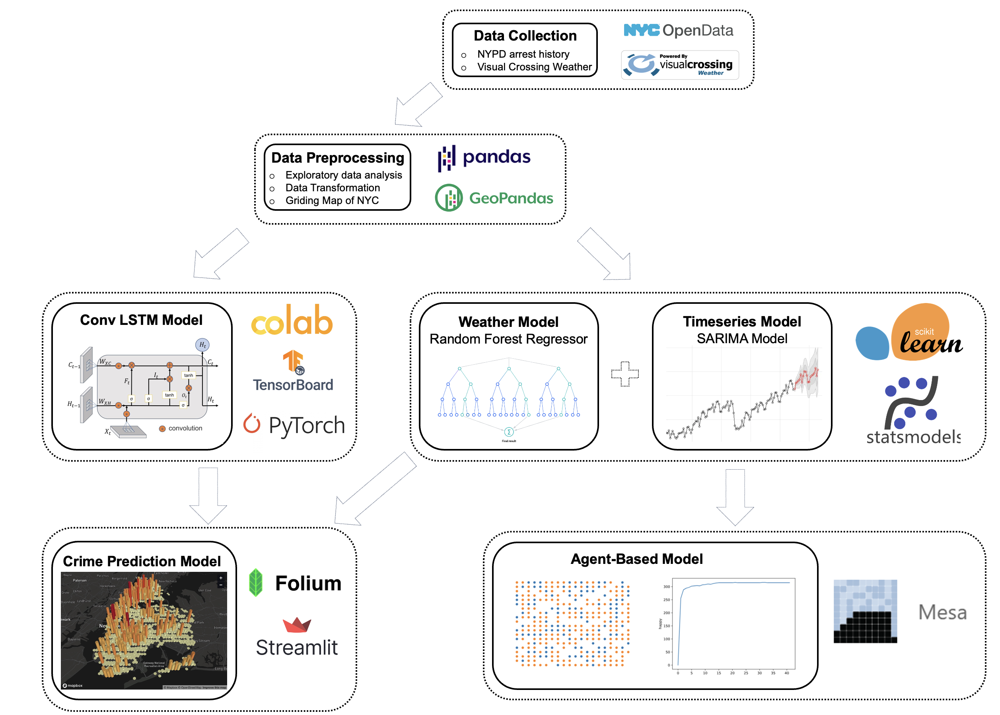
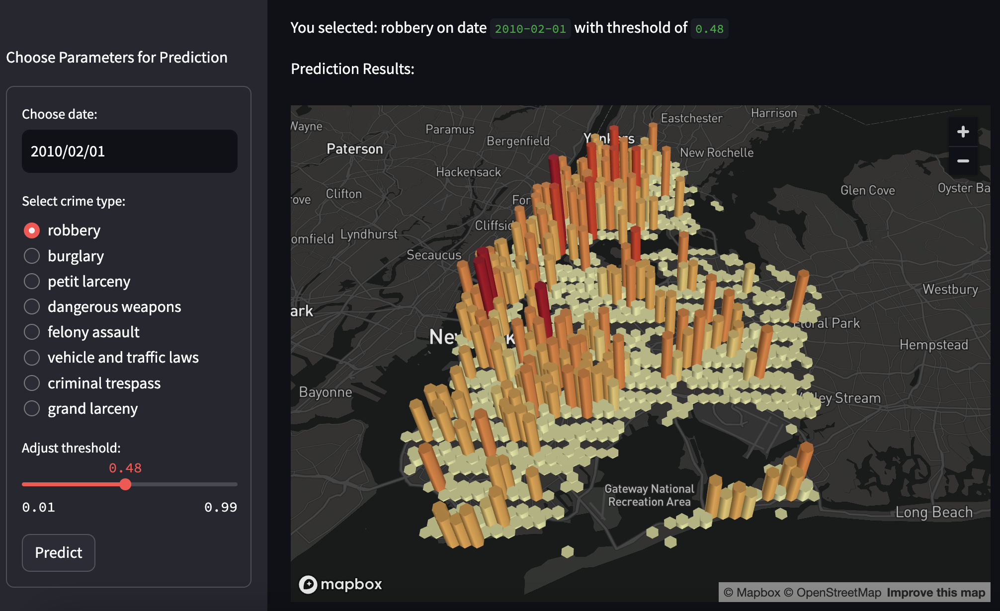
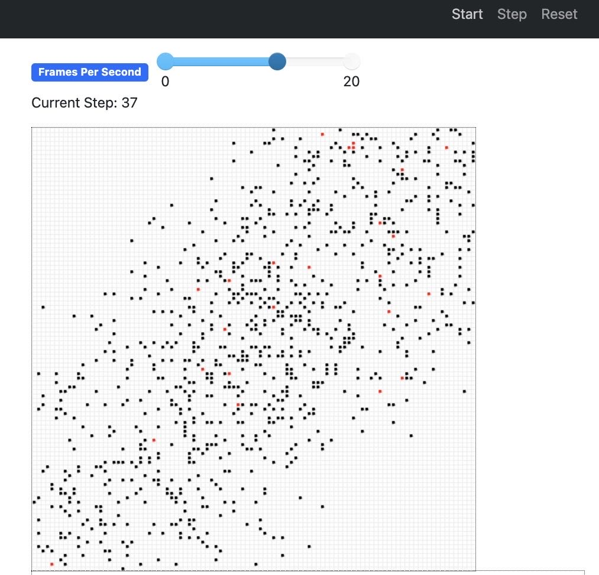

# IRP-lx122: Spatio-Temporal Crime Hotspot Prediction and Simulation of New York City

## Abstract

Predicting and simulating criminal patterns and trends helps identify potential crimes and quantify the various aspects that contribute to crime rate. And this aids decision-makers in implementing successful crime prevention strategies. Typically, this is done with methods of linear regression or theoretical connections. Nevertheless, these studies often take a narrow view of criminal behaviour, making them unsuitable for a holistic understanding. This article develops a crime prediction model that considers temporal, spatial, meteorological, and seasonal dimensions to predict various types of crime. The Convolutional Long Short-Term Memory model (ConvLSTM) was used to train and forecast crime locations using pre- processed NYPD arrest data in a temporal sequence. Weather fluctuations and seasonal variations on crime were examined using Random Forest Regression and Seasonal Auto Regressive Integrated Moving Average (SARIMA). The predictive model had 7.2 predictive accuracy index (PAI) with 8.1% prediction area coverage. Furthermore, by building on the machine learning models, this study created a data-driven Agent-Based model. This model simulates agent-environment and agent-agent interactions to inform criminal activity decisions. Demographic shifts, population migration, and extreme weather events are examined in this model. Ultimately, the predictive model can identify potential criminal activities to reduce crime, and the simulation model can examine crime rate fluctuations in different environmental contexts.

## Project Workflow
<div align=center>

</div>

## Crime Prediction Model Demo
<div align=center>

</div>

Install requirements:

```pip install -r requirements.txt```

Download required datasets and model weights:

Download NYPD historic arrest dataset from [link](https://drive.google.com/file/d/13wzrqIYQQr4xw4B6GzLcTGKs1O4mj2xS/view?usp=sharing) and save it to [`./Data/Datasets`](./Data/Datasets) 

Download model weight from [link](https://drive.google.com/file/d/13qcCVRyegruuFjoEaBq5AopGVbzqhTbr/view?usp=sharing) and save it to [`./Data/ModelWeights`](./Data/ModelWeights)

Go to [`./`](./) and run: (The first run may take a long time for data preprocessing)

```streamlit run code/GUI.py```

If you want to train the ConvLSTM model from scratch, go to [`./`](./) and run:

```python code/LSTMTrain.py```

P.S. To modify parameters for training, change the settings in [`./code/config.py`](./code/config.py)

## Agent-Based Model

<div align=center>

</div>

Go to [`./`](./) and run:

```python code/CrimeModelRun.py```
